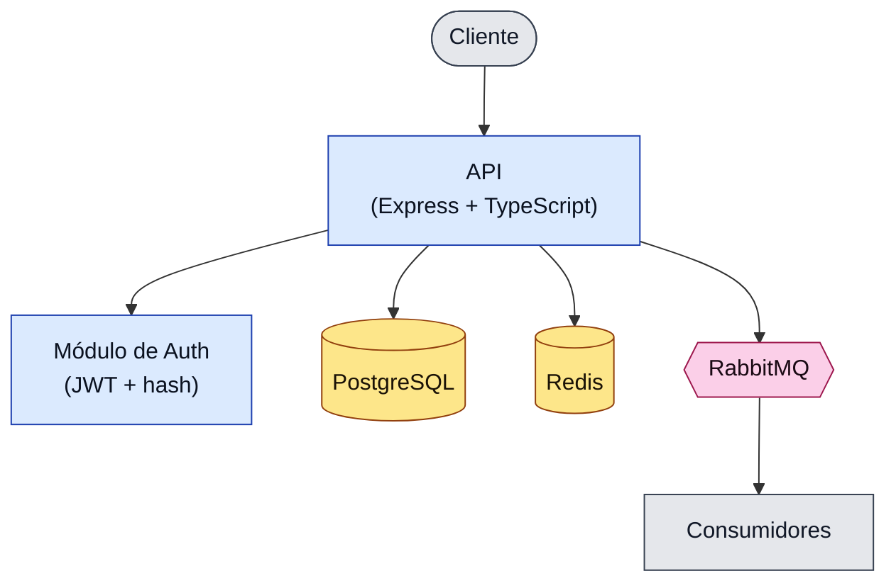

# Arquitetura — api-tasks-demo

## Legenda

- **Azul:** código da aplicação (API + módulo de auth).
- **Cilindros amarelos:** datastores (Postgres para dados, Redis para cache).
- **Hexágono rosa:** broker de mensageria (RabbitMQ).
- **Cinza:** atores externos ao serviço (cliente e consumidores assíncronos).
